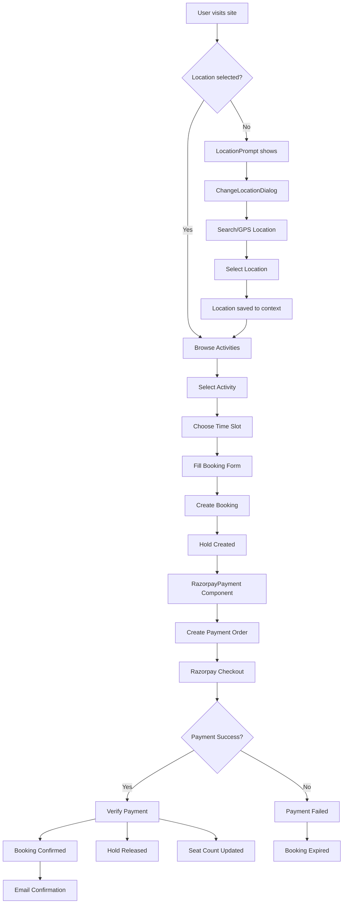
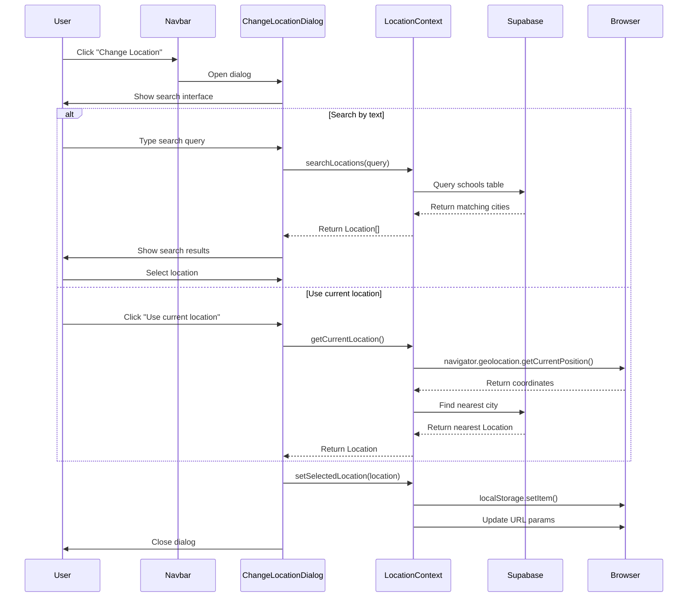

# Pelagos Architecture Documentation

## Functions

### Core Context Functions

#### AuthContext (`src/contexts/AuthContext.tsx`)
- **signIn**(email: string, password: string): Promise<{ error?: any }>
  - Purpose: Authenticate user with email and password
  - Returns: Promise with optional error object
- **signUp**(email: string, password: string, firstName?: string, lastName?: string, schoolName?: string, role?: string): Promise<{ error?: any }>
  - Purpose: Register new user account
  - Returns: Promise with optional error object
- **signInWithOAuth**(provider: 'google' | 'facebook'): Promise<{ error?: any }>
  - Purpose: OAuth authentication via social providers
  - Returns: Promise with optional error object
- **signOut**(): Promise<void>
  - Purpose: Sign out current user and clear session
  - Returns: Promise resolving to void

#### LocationContext (`src/contexts/LocationContext.tsx`)
- **searchLocations**(query: string): Promise<Location[]>
  - Purpose: Search for locations matching query string
  - Input: Search query string
  - Returns: Array of Location objects
- **getCurrentLocation**(): Promise<Location | null>
  - Purpose: Get user's current location via geolocation API
  - Returns: Location object or null if unavailable
- **getLocationBySlug**(slug: string): Promise<Location | null>
  - Purpose: Fetch location details by URL slug
  - Input: Location slug (kebab-case city name)
  - Returns: Location object or null
- **getLocationDisplayText**(location: any): string
  - Purpose: Format location for display in UI
  - Input: Location object
  - Returns: Formatted display string

### Booking Management

#### useBookings Hook (`src/hooks/useBookings.tsx`)
- **fetchBookings**(): Promise<void>
  - Purpose: Fetch bookings based on scope and user permissions
  - Supports both live and history modes
- **fetchMetrics**(): Promise<void>
  - Purpose: Fetch booking analytics metrics
  - Only available in live mode
- **refresh**(): Promise<void>
  - Purpose: Manually refresh bookings and metrics data
- **handleBookingUpdate**(payload: any): void
  - Purpose: Process real-time booking updates via Supabase subscription
- **handlePaymentUpdate**(payload: any): void
  - Purpose: Process real-time payment updates via Supabase subscription

### Payment Processing

#### RazorpayPayment Component (`src/components/RazorpayPayment.tsx`)
- **createPaymentOrder**(): Promise<RazorpayOrder>
  - Purpose: Create Razorpay payment order via Supabase function
  - Returns: Order details including orderId, amount, keyId
- **verifyPayment**(paymentData: RazorpayResponse): Promise<void>
  - Purpose: Verify payment success with backend
  - Input: Razorpay payment response with signature
- **handlePayment**(): Promise<void>
  - Purpose: Initialize Razorpay payment flow
  - Opens Razorpay checkout modal

### Location Management

#### ChangeLocationDialog (`src/components/location/ChangeLocationDialog.tsx`)
- **handleSearch**(query: string): Promise<void>
  - Purpose: Search for locations and update results
  - Input: Search query string
- **handleLocationSelect**(location: Location): void
  - Purpose: Set selected location and close dialog
- **handleUseCurrentLocation**(): Promise<void>
  - Purpose: Get and set user's current location

## API Endpoints

### Supabase Edge Functions

#### create-payment (`supabase/functions/create-payment/index.ts`)
- **Endpoint**: POST `/functions/v1/create-payment`
- **Purpose**: Create Razorpay payment order for booking
- **Input**:
  ```typescript
  {
    bookingId: string;
    amount: number;
    currency?: string; // defaults to 'INR'
  }
  ```
- **Output**:
  ```typescript
  {
    orderId: string;
    amount: number;
    currency: string;
    keyId: string;
    bookingCode: string;
    customerName: string;
    customerEmail: string;
  }
  ```
- **Authentication**: Requires user session
- **Validation**: Checks booking ownership and hold validity

#### verify-payment (`supabase/functions/verify-payment/index.ts`)
- **Endpoint**: POST `/functions/v1/verify-payment`
- **Purpose**: Verify Razorpay payment signature and update booking status
- **Input**:
  ```typescript
  {
    orderId: string;
    paymentId: string;
    signature: string;
    bookingId: string;
  }
  ```
- **Output**:
  ```typescript
  {
    success: boolean;
    bookingStatus: string;
    paymentId: string;
    bookingCode: string;
  }
  ```
- **Authentication**: Requires user session
- **Security**: Verifies Razorpay HMAC signature

#### fetch-water-news (`supabase/functions/fetch-water-news/index.ts`)
- **Endpoint**: GET `/functions/v1/fetch-water-news`
- **Purpose**: Fetch water sports news from RSS feeds
- **Query Parameters**:
  - `category`: string ('general', 'surfing', 'scuba', 'sailing', 'events')
  - `page`: number (default: 1)
  - `pageSize`: number (default: 8)
- **Output**:
  ```typescript
  {
    articles: NewsArticle[];
    totalResults: number;
    status: string;
  }
  ```
- **Data Sources**: SwimSwam, World Sailing, Surfer Magazine RSS feeds

#### razorpay-webhook (`supabase/functions/razorpay-webhook/index.ts`)
- **Endpoint**: POST `/functions/v1/razorpay-webhook`
- **Purpose**: Handle Razorpay payment webhooks
- **Input**: Razorpay webhook payload with HMAC signature
- **Events Handled**:
  - `payment.captured`: Update booking to paid status
  - `payment.authorized`: Mark payment as authorized
  - `payment.failed`: Mark booking as expired
- **Security**: Verifies webhook signature with RAZORPAY_WEBHOOK_SECRET

### Supabase Database Functions

#### get_live_bookings
- **Purpose**: Fetch real-time booking data with filters
- **Parameters**:
  - `p_school_id`: string (optional, for school partner filtering)
  - `p_date_filter`: string ('today', 'upcoming', 'all')

#### get_booking_metrics
- **Purpose**: Fetch booking analytics and metrics
- **Parameters**:
  - `p_school_id`: string (optional)
  - `p_start_date`: string (ISO date)

## Mermaid Diagrams

### Booking Flow



### Change Location Sequence



### Core Types Class Diagram

```mermaid
classDiagram
    class User {
        +id: string
        +email: string
        +first_name?: string
        +last_name?: string
        +school_name?: string
        +role?: string
        +created_at: string
        +signIn(email, password)
        +signUp(userData)
        +signOut()
    }

    class Location {
        +id: string
        +name: string
        +city: string
        +state?: string
        +country?: string
        +latitude: number
        +longitude: number
        +slug: string
        +searchLocations(query)
        +getCurrentLocation()
        +getLocationBySlug(slug)
    }

    class Activity {
        +id: string
        +name: string
        +description: string
        +price: number
        +duration: number
        +max_participants: number
        +school_id: string
        +sport_id: string
        +equipment_provided: boolean
    }

    class Booking {
        +id: string
        +booking_code: string
        +customer_name: string
        +customer_email: string
        +customer_phone?: string
        +activity_booked: string
        +booking_date: string
        +time_slot: string
        +participants: number
        +amount: number
        +payment_status: PaymentStatus
        +status: BookingStatus
        +school_id: string
        +user_id: string
        +time_slot_id?: string
        +created_at: string
    }

    class Payment {
        +id: string
        +booking_id: string
        +amount: number
        +currency: string
        +status: PaymentStatus
        +provider: string
        +intent_id: string
        +is_verified: boolean
        +verified_at?: string
        +created_at: string
        +createPaymentOrder()
        +verifyPayment(signature)
    }

    class TimeSlot {
        +id: string
        +start_time: string
        +end_time: string
        +date: string
        +seats_total: number
        +seats_left: number
        +activity_id: string
        +school_id: string
    }

    class School {
        +id: string
        +name: string
        +display_name?: string
        +city: string
        +latitude?: number
        +longitude?: number
        +is_active: boolean
        +contact_email?: string
        +contact_phone?: string
    }

    User ||--o{ Booking : creates
    Location ||--o{ School : contains
    School ||--o{ Activity : offers
    Activity ||--o{ TimeSlot : has
    Activity ||--o{ Booking : booked_for
    Booking ||--|| Payment : has
    TimeSlot ||--o{ Booking : scheduled_at
    School ||--o{ Booking : receives

    class PaymentStatus {
        <<enumeration>>
        INITIATED
        SUCCEEDED
        FAILED
        PENDING
    }

    class BookingStatus {
        <<enumeration>>
        HELD
        PAID_DEPOSIT
        CONFIRMED
        EXPIRED
        CANCELLED
    }
```

## Architecture Notes

### Authentication Flow
- Uses Supabase Auth with email/password and OAuth (Google, Facebook)
- AuthContext manages session state and provides auth methods
- ProtectedRoute and AdminProtectedRoute guard routes based on auth status
- JWT tokens stored in localStorage with auto-refresh

### Location Management
- LocationContext provides global location state
- Supports search by text query and GPS geolocation
- Location data derived from schools table (cities where activities are available)
- Persists selected location in localStorage and URL parameters

### Payment Processing
- Integrated with Razorpay for Indian payment methods (UPI, cards, wallets)
- Two-step verification: create order → verify payment signature
- Webhook handling for automatic booking confirmation
- Booking holds system prevents double-booking during payment flow

### Real-time Updates
- useBookings hook supports both live and history modes
- Live mode uses Supabase real-time subscriptions
- Fallback polling for connection failures
- Real-time updates for bookings, payments, and metrics

### Data Architecture
- PostgreSQL database via Supabase
- Row Level Security (RLS) for data access control
- School partners can only access their own bookings
- Passholder role has cross-school access
- Audit logging for admin actions

### Security Features
- HMAC signature verification for payment webhooks
- RLS policies restrict data access by user role
- Environment variables for API keys and secrets
- CORS headers configured for cross-origin requests
- Input validation and sanitization